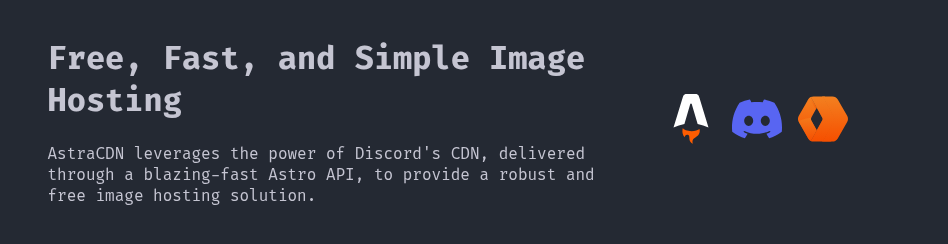

<div align="center">


# AstraCDN



### Tech Stack

<svg viewBox="0 0 256 366" width="50" height="50" preserveAspectRatio="xMidYMid"><path fill="#fff" d="M182.022 9.147c2.982 3.702 4.502 8.697 7.543 18.687L256 246.074a276.467 276.467 0 0 0-79.426-26.891L133.318 73.008a5.63 5.63 0 0 0-10.802.017L79.784 219.11A276.453 276.453 0 0 0 0 246.04L66.76 27.783c3.051-9.972 4.577-14.959 7.559-18.654a24.541 24.541 0 0 1 9.946-7.358C88.67 0 93.885 0 104.314 0h47.683c10.443 0 15.664 0 20.074 1.774a24.545 24.545 0 0 1 9.95 7.373Z"/><path fill="#FF5D01" d="M189.972 256.46c-10.952 9.364-32.812 15.751-57.992 15.751-30.904 0-56.807-9.621-63.68-22.56-2.458 7.415-3.009 15.903-3.009 21.324 0 0-1.619 26.623 16.898 45.14 0-9.615 7.795-17.41 17.41-17.41 16.48 0 16.46 14.378 16.446 26.043l-.001 1.041c0 17.705 10.82 32.883 26.21 39.28a35.685 35.685 0 0 1-3.588-15.647c0-16.886 9.913-23.173 21.435-30.48 9.167-5.814 19.353-12.274 26.372-25.232a47.588 47.588 0 0 0 5.742-22.735c0-5.06-.786-9.938-2.243-14.516Z"/></svg>
<svg viewBox="0 0 256 231" width="50" height="50" preserveAspectRatio="xMidYMid"><defs><linearGradient id="cf-a" x1="0%" y1="0%" x2="100%" y2="100%"><stop offset="0%" stop-color="#F6821F"/><stop offset="100%" stop-color="#FBAD41"/></linearGradient><linearGradient id="cf-b" x1="0%" y1="0%" x2="100%" y2="100%"><stop offset="0%" stop-color="#F6821F"/><stop offset="100%" stop-color="#FBAD41"/></linearGradient><linearGradient id="cf-c" x1="0%" y1="0%" x2="100%" y2="100%"><stop offset="0%" stop-color="#F6821F"/><stop offset="100%" stop-color="#FBAD41"/></linearGradient><linearGradient id="cf-d" x1="0%" y1="0%" x2="100%" y2="100%"><stop offset="0%" stop-color="#F6821F"/><stop offset="100%" stop-color="#FBAD41"/></linearGradient><linearGradient id="cf-e" x1="0%" y1="0%" x2="100%" y2="100%"><stop offset="0%" stop-color="#F6821F"/><stop offset="100%" stop-color="#FBAD41"/></linearGradient><linearGradient id="cf-f" x1="0%" y1="0%" x2="100%" y2="100%"><stop offset="0%" stop-color="#F6821F"/><stop offset="100%" stop-color="#FBAD41"/></linearGradient><linearGradient id="cf-g" x1="0%" y1="0%" x2="100%" y2="100%"><stop offset="0%" stop-color="#F6821F"/><stop offset="100%" stop-color="#FBAD41"/></linearGradient><linearGradient id="cf-h" x1="0%" y1="0%" x2="100%" y2="100%"><stop offset="0%" stop-color="#F6821F"/><stop offset="100%" stop-color="#FBAD41"/></linearGradient></defs><path fill="url(#cf-a)" d="m65.82 3.324 30.161 54.411-27.698 49.857a16.003 16.003 0 0 0 0 15.573l27.698 49.98-30.16 54.411a32.007 32.007 0 0 1-13.542-12.74L4.27 131.412a32.13 32.13 0 0 1 0-32.007l48.01-83.403a32.007 32.007 0 0 1 13.542-12.68Z"/><path fill="url(#cf-b)" d="M68.283 107.654a16.003 16.003 0 0 0 0 15.51l27.698 49.98-30.16 54.412a32.007 32.007 0 0 1-13.542-12.74L4.27 131.412c-3.816-6.586 17.542-14.465 64.014-23.698v-.061Z" opacity=".7"/><path fill="url(#cf-c)" d="m68.898 8.802 27.083 48.933-4.493 7.818-23.882-40.44c-6.894-11.264-17.42-5.416-30.591 17.358l1.97-3.386 13.294-23.082a32.007 32.007 0 0 1 13.542-12.68Z"/><path fill="url(#cf-d)" d="m127.83 115.44 27.698-49.98 30.16-54.411a32.007 32.007 0 0 1 13.543 12.68l48.01 83.403a32.13 32.13 0 0 1 0 32.007l-48.01 83.403a32.007 32.007 0 0 1-13.542 12.74l-30.16-54.411-27.698-49.98a16.003 16.003 0 0 0 0-15.45Z"/><path fill="url(#cf-e)" d="m127.83 115.44 27.698-49.98-4.493-7.818-23.882 40.44c-6.894 11.264-17.42 5.416-30.591-17.358l1.97 3.386 13.294 23.082a16.003 16.003 0 0 0 16.004 0Z" opacity=".5"/><path fill="url(#cf-f)" d="m127.83 115.44 27.698 49.98-4.493 7.818-23.882-40.44c-6.894-11.264-17.42-5.416-30.591 17.358l1.97-3.386 13.294-23.082a16.003 16.003 0 0 1 16.004.001Z" opacity=".5"/><path fill="url(#cf-g)" d="m188.18 227.67-30.16-54.411 27.698-49.98a16.003 16.003 0 0 0 0-15.573l-27.698-49.857 30.16-54.411a32.007 32.007 0 0 1 13.543 12.68l48.01 83.403a32.13 32.13 0 0 1 0 32.007l-48.01 83.403a32.007 32.007 0 0 1-13.542 12.74Z"/><path fill="url(#cf-h)" d="M185.72 123.21a16.003 16.003 0 0 0 0-15.51L158.02 57.72l30.16-54.412a32.007 32.007 0 0 1 13.543 12.68l48.01 83.403c3.816 6.586-17.542 14.465-64.014 23.758v.06Z" opacity=".7"/></svg>
<svg viewBox="0 0 256 199" width="50" height="50" preserveAspectRatio="xMidYMid"><path d="M216.856 16.597A208.502 208.502 0 0 0 164.042 0c-2.275 4.113-4.933 9.645-6.766 14.046-19.692-2.961-39.203-2.961-58.533 0-1.832-4.4-4.55-9.933-6.846-14.046a207.809 207.809 0 0 0-52.855 16.638C5.618 67.147-3.443 116.4 1.087 164.956c22.169 16.555 43.653 26.612 64.775 33.193A161.094 161.094 0 0 0 79.735 175.3a136.413 136.413 0 0 1-21.846-10.632 108.636 108.636 0 0 0 5.356-4.237c42.122 19.702 87.89 19.702 129.51 0a131.66 131.66 0 0 0 5.355 4.237 136.07 136.07 0 0 1-21.886 10.653c4.006 8.02 8.638 15.67 13.873 22.848 21.142-6.58 42.646-16.637 64.815-33.213 5.316-56.288-9.08-105.09-38.056-148.36ZM85.474 135.095c-12.645 0-23.015-11.805-23.015-26.18s10.149-26.2 23.015-26.2c12.867 0 23.236 11.804 23.015 26.2.02 14.375-10.148 26.18-23.015 26.18Zm85.051 0c-12.645 0-23.014-11.805-23.014-26.18s10.148-26.2 23.014-26.2c12.867 0 23.236 11.804 23.015 26.2 0 14.375-10.148 26.18-23.015 26.18Z" fill="#5865F2"/></svg>

**Astro** • **Cloudflare Workers** • **Discord**

---

*A simple and fast CDN built for the modern web*

[](https://workers.cloudflare.com)
[](LICENSE)
[](https://discord.com)

</div>

---

## ✨ Features

- **⚡ Lightning Fast**: Built on Cloudflare Workers for edge-first delivery
- **🌍 Global Scale**: Automatically distributed across Cloudflare's global network
- **🤖 Discord Integration**: Seamless notifications and monitoring via Discord
- **🚀 Easy Deploy**: Get your CDN running in minutes, not hours
- **🎨 Customizable**: Tailor the CDN to your specific needs
- **📦 Modern Stack**: Built with cutting-edge technologies

---

## 🛠️ Getting Started

### Prerequisites

Before you begin, ensure you have the following installed:

- [Node.js](https://nodejs.org/en/) (v18 or higher)
- [Git](https://git-scm.com/)
- A [Discord Bot Token](https://discord.com/developers/applications)

### 📥 Installation

1. **Clone the repository**

   ```bash
   git clone https://github.com/swadhinbiswas/AstraCDN.git
   cd AstraCDN
   ```

2. **Install dependencies**

   ```bash
   npm install
   ```

3. **Configure environment variables**

   Create a `.env` file in the root directory:

   ```env
   TURSO_URL="your-turso-database-url"
   TURSO_AUTH_TOKEN="your-turso-auth-token"
   DB_NAME="AstraCDN"
   BOT_TOKEN="your-discord-bot-token"
   CHANNEL_ID="your-discord-channel-id"
   ```

   **How to get your Discord credentials:**
   - **BOT_TOKEN**: Create a bot at [Discord Developer Portal](https://discord.com/developers/applications)
   - **CHANNEL_ID**: Right-click on a Discord channel and select "Copy ID" (requires Developer Mode enabled)

4. **Start the development server**

   ```bash
   npm run dev
   ```

   Your CDN should now be running at `http://localhost:4321` 🎉

---

## 🚀 Deployment

Deploy your CDN to Cloudflare Workers in two simple steps:

1. **Build the project**

   ```bash
   npm run build
   ```

2. **Deploy to Cloudflare**

   ```bash
   wrangler deploy
   ```

---

## ⚡ Cloudflare CDN Activation

Supercharge your deployment with Cloudflare's global CDN network:

### Step 1: Get a Domain

Purchase a domain from any domain registrar if you don't already have one.

### Step 2: Transfer to Cloudflare

1. Sign up at [cloudflare.com](https://www.cloudflare.com)
2. Add your domain through the setup wizard
3. Update your domain's nameservers to Cloudflare's nameservers
4. Wait for DNS propagation (typically a few hours, max 48 hours)

### Step 3: Configure DNS

- Point your A records or CNAME records to your Cloudflare Workers deployment
- Cloudflare will automatically cache and serve your content globally

### Step 4: Optimize (Optional)

Enable additional features in your Cloudflare dashboard:

- **Browser Cache Expiration** - Control client-side caching
- **Development Mode** - Bypass cache during testing
- **Always Online** - Serve cached versions if origin is down
- **Polish** - Automatic image optimization
- **Rocket Loader** - JavaScript optimization

> **💡 Pro Tip**: Simply pointing your domain to Cloudflare automatically activates the CDN. No additional code changes needed!

---

## 🤖 Discord Integration

AstraCDN includes Discord integration for real-time notifications and monitoring:

- **Upload Notifications**: Get notified when files are uploaded
- **CDN Analytics**: Monitor usage and performance metrics
- **Error Alerts**: Receive instant alerts for critical issues

Make sure to configure your `BOT_TOKEN` and `CHANNEL_ID` in the `.env` file to enable Discord features.

---

# AstraCDN - Cloudflare Deployment Guide

This document provides a comprehensive guide to deploy your AstraCDN application to Cloudflare Workers.

## Prerequisites

Before deploying your AstraCDN application, ensure you have:

1. **Node.js** (v18 or higher)
2. **Git**
3. **A Discord Bot** with access to a channel where images can be uploaded
4. **Turso connection string** (or self-hosted)
5. **Wrangler CLI** installed globally (optional): `npm install -g wrangler`

## Environment Variables Setup

Your application requires the following environment variables:

- `TURSO_URL`: Your Turso database URL
- `TURSO_AUTH_TOKEN`: Your Turso auth token
- `DB_NAME`: Database name (defaults to "AstraCDN" in wrangler.toml)
- `BOT_TOKEN`: Your Discord bot token
- `CHANNEL_ID`: The Discord channel ID where images will be uploaded

## Deployment Steps

### 1. Install Dependencies

```bash
npm install
```

### 2. Configure Environment Variables

Before deploying, you must set your environment secrets using the Wrangler CLI:

```bash
# Set your Discord bot token
npx wrangler secret put BOT_TOKEN

# Set your Turso URL
npx wrangler secret put TURSO_URL

# Set your Turso Auth Token
npx wrangler secret put TURSO_AUTH_TOKEN

# Set your Discord channel ID
npx wrangler secret put CHANNEL_ID
```

When prompted, enter the corresponding values for each secret.

### 3. Build the Application

```bash
npm run build
```

This creates the optimized build in the `dist/` directory.

### 4. Deploy to Cloudflare

```bash
npx wrangler deploy
```

### 5. Custom Domain (Optional)

To use a custom domain with your deployed application:

1. Go to your [Cloudflare Dashboard](https://dash.cloudflare.com)
2. Navigate to "Workers & Pages" → "Overview" → "Domains"
3. Click "Add domain"
4. Enter your subdomain (e.g., `cdn.yourdomain.com`)
5. Follow the instructions to set up DNS records

## Configuration Details

### wrangler.toml

The `wrangler.toml` file in your project is configured for optimal deployment:

```toml
name = "astracdn"  # Your worker name
main = "dist/_worker.js"  # Entry point for your application
account_id = "86d20513ca452bfb3c1c1de241e869f6"  # Your Cloudflare account ID
compatibility_date = "2024-03-12"
compatibility_flags = ["nodejs_compat"]  # Enables Node.js compatibility

# Environment variables
[vars]
DB_NAME = "AstraCDN"

[build]
command = "npm run build"

[observability.logs]
enabled = true  # Enables logging for debugging
```

### Astro Configuration

Your `astro.config.mjs` is already configured with the Cloudflare adapter:

```javascript
import cloudflare from '@astrojs/cloudflare';

export default defineConfig({
  output: 'server',  // Server-side rendering
  adapter: cloudflare(),  // Cloudflare adapter
  // Additional configuration...
});
```

## Application Architecture

AstraCDN operates as follows:

1. **Upload Process**:
   - Client uploads an image to `/api/upload`
   - Application stores the image in a Discord channel via the Discord API
   - Metadata is stored in Turso
   - Returns a URL like `/api/file/{fileId}` for accessing the image

2. **Retrieval Process**:
   - When someone accesses `/api/file/{fileId}`, the application:
     - Retrieves the Discord message metadata from Turso
     - Fetches the image from Discord CDN
     - Serves the image with appropriate headers and caching

## Performance Considerations

- The application uses Discord's fast global CDN for image delivery
- Images are cached in the worker with a 1-hour cache-control header
- The application is deployed on Cloudflare's global network for low latency

## Monitoring and Logs

- Access logs via the Cloudflare Dashboard under Workers
- The application has observability enabled to track requests and errors
- Monitor your Turso logs for database performance

## Troubleshooting

### Common Issues:

1. **Upload errors**: Check that your Discord bot has proper permissions in the channel
2. **Database errors**: Verify your Turso connection string is correct
3. **404 on file access**: Ensure the file exists in the Discord channel and database

### Debugging:

Check logs via the Cloudflare Dashboard or use:
```bash
npx wrangler tail
```

This provides real-time logs from your deployed worker.

## Updating Your Application

To update your deployed application:

1. Make your code changes
2. Test locally: `npm run dev`
3. Build the application: `npm run build`
4. Deploy: `npx wrangler deploy`

## Security Best Practices

- Store sensitive information (Discord token, Turso URL, Turso Auth Token) as secret variables
- Use environment-specific configuration
- Regularly rotate your Discord bot token
- Monitor your application logs for unusual activity

## Cost Considerations

- Cloudflare Workers: First 100,000 requests per day are free
- Turso: Offers a generous free tier for development
- Discord: No direct costs for storing images in channels

For production usage, review the pricing of each service based on your expected traffic.


## 🏗️ Project Structure

```
AstraCDN/
├── public/
│   ├── icon.svg
│   └── image.png
├── src/
│   └── ...
├── .env
├── package.json
└── README.md
```

---

## 🤝 Contributing

Contributions are welcome! Feel free to:

- 🐛 Report bugs
- 💡 Suggest new features
- 🔧 Submit pull requests

---

## 👨‍💻 Creator

<div align="center">

**[Swadhin Biswas](https://github.com/swadhinbiswas)**

[](https://github.com/swadhinbiswas)

</div>

---

## 📄 License

This project is open source and available under the [MIT License](LICENSE).

---

<div align="center">

**[⬆ Back to Top](#astracdn)**

Made with ❤️ by [Swadhin Biswas](https://github.com/swadhinbiswas)

</div>

